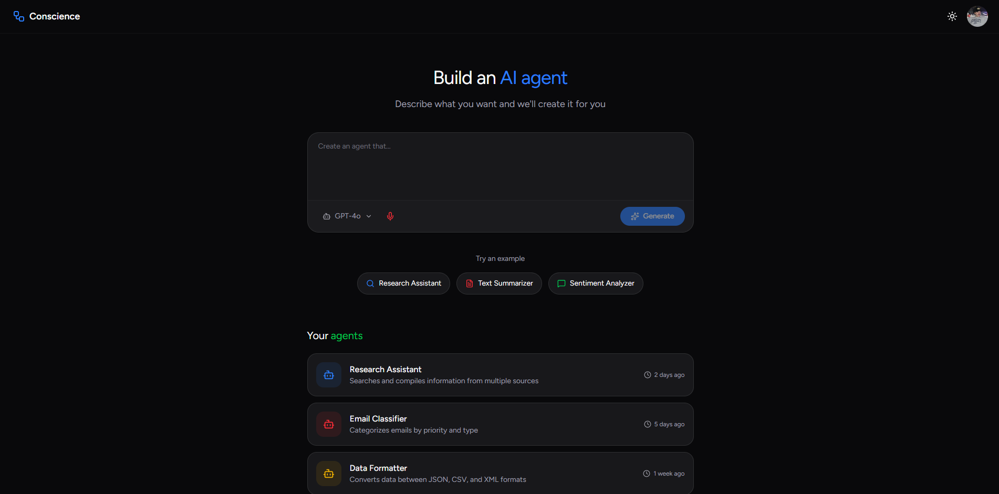

# Conscience

**A natural language AI agent builder** — Describe what you want, and Conscience generates the tools, logic, and visual workflow automatically.



## What is Conscience?

Conscience is a full-stack platform that enables users to create AI agents through natural language descriptions. Instead of writing code, users simply describe what they want an agent to do, and the system:

1. **Parses the request** using LLMs to understand the required capabilities
2. **Generates tool code** (Python functions) to perform the specified tasks
3. **Creates orchestration logic** to route inputs to the correct tools
4. **Visualizes the workflow** on an interactive canvas using React Flow
5. **Executes workflows** in real-time with streaming status updates

### Example

> *"Create an agent that analyzes customer feedback — detect sentiment, extract key topics, and flag urgent issues"*

Conscience will automatically generate tools for sentiment analysis, topic extraction, and urgency detection, then create a workflow that processes feedback through each step and outputs a structured report.

## Tech Stack

### Frontend
- **Next.js 16** with React 19
- **React Flow** for interactive workflow visualization
- **Tailwind CSS** for styling
- **Supabase Auth** for authentication

### Backend
- **FastAPI** (Python 3.12+)
- **SQLAlchemy** with Alembic migrations
- **OpenAI API** for LLM-powered code generation
- **Server-Sent Events** for real-time execution streaming

### Database
- **Supabase** (PostgreSQL)

## Key Features

- **Natural Language Agent Creation** — No coding required to build functional AI agents
- **Automatic Code Generation** — LLM generates validated Python tool code
- **Visual Workflow Builder** — Drag-and-drop canvas with real-time execution visualization
- **Reusable Architecture** — Base orchestrator pattern minimizes regenerated code
- **User Authentication** — Secure, user-scoped agents and workflows
- **Execution History** — Track and replay workflow runs

## Architecture Overview

```
┌─────────────────────────────────────────────────────────────────┐
│                      FRONTEND (Next.js)                         │
│  Chat UI  →  Canvas (React Flow)  →  Tool Sidebar               │
└─────────────────────────────────────────────────────────────────┘
                              │
                              ▼
┌─────────────────────────────────────────────────────────────────┐
│                      BACKEND (FastAPI)                          │
│  Agent Builder  →  Tool Generator  →  Workflow Executor         │
│  Base Orchestrator  |  Tool Registry  |  LLM Service            │
└─────────────────────────────────────────────────────────────────┘
                              │
                              ▼
┌─────────────────────────────────────────────────────────────────┐
│                      DATABASE (Supabase)                        │
│  agents  |  tools  |  workflows  |  executions                  │
└─────────────────────────────────────────────────────────────────┘
```

## Getting Started

### Prerequisites
- Python 3.12+
- Node.js 18+
- Supabase account
- OpenAI API key

### Backend Setup
```bash
# Install dependencies
uv sync

# Configure environment
cp .env.example .env
# Add your OPENAI_API_KEY and SUPABASE credentials

# Run migrations
alembic upgrade head

# Start the server
uvicorn main:app --reload
```

### Frontend Setup
```bash
cd ui

# Install dependencies
npm install

# Configure environment
cp .env.example .env.local
# Add your Supabase credentials

# Start the dev server
npm run dev
```

## Project Status

This project is in active development. See [docs/project.md](docs/project.md) for the full technical specification and roadmap.

## License

MIT
